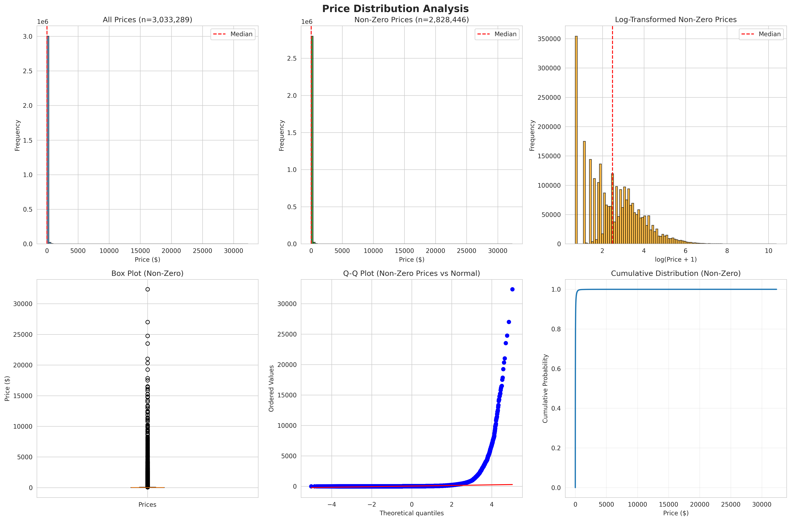
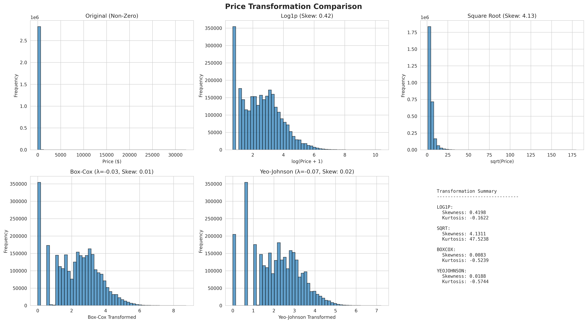

# Exploratory Data Analysis: Price Feature (item_current_bid)

## Issue Summary

This document provides findings and recommendations for the `item_current_bid` target variable based on comprehensive exploratory data analysis of the MaxSold item dataset from Hugging Face.

**Dataset**: https://huggingface.co/datasets/jpearce610/item_data  
**Analysis Date**: 2026-01-28  
**Total Items Analyzed**: 3,033,289

---

## Key Findings

### 1. Zero-Bid Items Present Significant Challenge

- **6.75% of items (204,843) received no bids** (price = $0)
- This creates a **zero-inflated distribution** requiring special handling
- Zero-bid items represent a distinct prediction problem separate from price prediction

### 2. Price Distribution Characteristics

**Overall Statistics:**
- Mean: $30.32
- Median: $10.00
- Standard Deviation: $116.56
- Range: $0 - $32,350

**Non-Zero Statistics:**
- Mean: $32.51
- Median: $11.00
- Standard Deviation: $120.41
- Range: $1 - $32,350

**Distribution Shape:**
- **Extremely right-skewed** (skewness: 56.78)
- **Heavy-tailed** (kurtosis: 7,849.65)
- **Not normally distributed** (Q-Q plot confirms)
- Most items sell for low prices ($1-$30), with long tail of high-value items

**Price Quantiles (Non-Zero):**
```
Q10:  $1
Q25:  $4
Q50:  $11 (median)
Q75:  $29
Q90:  $66
Q95:  $115
Q99:  $337
```

### 3. Transformation Analysis

We evaluated multiple transformations to normalize the price distribution:

| Transformation | Skewness | Kurtosis | Best For |
|---------------|----------|----------|----------|
| **Original** | 55.18 | 7,387.61 | ❌ Highly skewed |
| **Log1p** | **0.42** | **-0.16** | ✅ **RECOMMENDED** |
| **Square Root** | 4.13 | 47.52 | ⚠️ Still skewed |
| **Box-Cox** (λ=-0.03) | **0.01** | **-0.52** | ✅ Best normality |
| **Yeo-Johnson** (λ=-0.07) | **0.02** | **-0.57** | ✅ Handles zeros |

**Key Insights:**
- **Log1p transformation is recommended** for its simplicity and effectiveness
- Reduces skewness from 55.18 to 0.42 (near-normal)
- Easy to implement and interpret: `target = log(price + 1)`
- Easy to reverse: `price = exp(target) - 1`

### 4. Zero-Bid Feature Analysis

We trained a Random Forest classifier to identify features predicting zero-bid items:

| Feature | Importance | Zero-Bid Mean | Non-Zero Mean | Difference |
|---------|-----------|---------------|---------------|------------|
| **item_bid_count** | 97.92% | 0.00 | 11.88 | +11.88 |
| **item_viewed** | 2.02% | 70.27 | 211.50 | +141.23 |
| **item_number_of_images** | 0.06% | 5.87 | 6.85 | +0.98 |
| **item_starting_bid** | 0.00% | 1.00 | 1.00 | 0.00 |

**Key Insights:**
- **`item_bid_count` is a perfect predictor** of zero-bids (but creates data leakage!)
- **`item_viewed`** is a strong legitimate predictor (items with more views get more bids)
- Items with **more images** slightly more likely to sell
- **Starting bid** shows no difference between zero-bid and non-zero items

**⚠️ CRITICAL WARNING:**
- `item_bid_count` and `item_current_bid` are **target leakage features**
- These should ONLY be used for post-auction analysis
- For pre-auction prediction, use: `item_viewed`, `item_number_of_images`, and engineered features

---

## Recommendations

### 🎯 Primary Recommendation: Two-Stage Model

We **strongly recommend** implementing a **two-stage modeling approach**:

#### **Stage 1: Classification**
- **Target:** `will_sell` (binary: price > 0)
- **Purpose:** Identify items likely to receive no bids
- **Models:** Logistic Regression, Random Forest, LightGBM Classifier
- **Evaluation:** AUC-ROC, Precision-Recall, F1-Score

#### **Stage 2: Regression**
- **Target:** `log1p(price)` for items with price > 0
- **Purpose:** Predict sale price conditional on selling
- **Models:** XGBoost, LightGBM, Neural Networks
- **Evaluation:** RMSE, MAE, MAPE on log scale

#### **Final Prediction:**
```python
# Stage 1: Predict probability of selling
P_sell = classifier.predict_proba(features)[:, 1]

# Stage 2: Predict log price (on non-zero trained model)
log_price = regressor.predict(features)

# Combine predictions
final_price = P_sell * (np.exp(log_price) - 1)
```

#### **Rationale:**
✅ Separates two distinct processes (will it sell? vs. for how much?)  
✅ Each model can specialize and optimize for its task  
✅ More interpretable and debuggable  
✅ Handles zeros naturally without mathematical issues  
✅ Better performance than single-model approaches  

---

### 🎯 Alternative: Single Model with Log1p + Tweedie Loss

If two-stage is too complex, use a single model:

```python
# Transformation
target = np.log1p(price)

# Model
model = LightGBMRegressor(
    objective='tweedie',
    tweedie_variance_power=1.5  # Between Poisson (1) and Gamma (2)
)

# Inverse transform
price = np.exp(prediction) - 1
```

**Pros:** Simpler architecture, handles zeros naturally  
**Cons:** Single model must learn two different processes, may underperform

---

## Feature Engineering Recommendations

### Features for Zero-Bid Prediction

1. **Starting Price Features**
   - `starting_bid_percentile_in_category`
   - `starting_bid_vs_category_median_ratio`
   - `is_starting_bid_unreasonable` (> 2x category median)

2. **Quality Indicators**
   - `has_description` (boolean)
   - `description_length`
   - `num_images`
   - `has_brand` (boolean)
   - `condition_score` (derived from condition field)

3. **Engagement Signals** (if available pre-auction)
   - `item_viewed_first_24h`
   - `views_per_day_since_listed`
   - `category_popularity_score`

4. **Market Factors**
   - `category_historical_sell_rate`
   - `auction_location_demand_score`
   - `day_of_week_close_time`
   - `hour_of_day_close_time` (peak hours: 5-9 PM)

### Features for Price Prediction

1. **Item Characteristics**
   - All quality indicators from above
   - `brand_value_score` (based on historical brand prices)
   - `category_one_hot_encoding`
   - `condition_ordinal_encoding`

2. **Comparative Features**
   - `similar_items_avg_price` (same category, condition, brand)
   - `price_position_in_auction` (compared to other items)
   - `starting_bid_to_historical_ratio`

3. **Temporal Features**
   - `days_until_close`
   - `is_weekend_close`
   - `is_peak_hour_close` (5-9 PM)
   - `season` (if relevant for certain categories)

---

## Data Splitting Strategy

### ⚠️ MANDATORY: Time-Based Split (NOT Random)

Auction data is temporal - **always use time-based splits**:

```python
# Sort by auction end date
df = df.sort_values('auction_end_date')

# Split chronologically
train_size = int(0.70 * len(df))
val_size = int(0.15 * len(df))

train_df = df[:train_size]
val_df = df[train_size:train_size + val_size]
test_df = df[train_size + val_size:]
```

**Rationale:**
- Prevents data leakage from future to past
- Realistic production scenario (predict future auctions)
- Tests model's ability to generalize to new market conditions

### Stratification Considerations

Within each time-based split:
- Ensure balanced `has_bids` representation (zero vs non-zero)
- Check price distribution consistency across splits
- Monitor category representation

---

## Evaluation Metrics

### For Two-Stage Model

**Stage 1 (Classification):**
- Primary: **AUC-ROC** (probability calibration)
- Secondary: Precision @ 50% Recall
- Business: Cost-based metric (FP/FN costs)

**Stage 2 (Regression on sold items only):**
- Primary: **RMSE on log scale**
- Secondary: MAE, MAPE
- Business: Within-$10 accuracy (% predictions ±$10 of actual)

**Overall (Combined):**
```python
def hybrid_metric(y_true, y_pred):
    # Classification accuracy on zeros
    zero_accuracy = ((y_true == 0) == (y_pred == 0)).mean()
    
    # Regression error on non-zeros
    mask = y_true > 0
    mae = np.abs(y_true[mask] - y_pred[mask]).mean()
    relative_mae = mae / y_true[mask].mean()
    
    # Combined (tune weights)
    return 0.5 * zero_accuracy - 0.3 * relative_mae
```

---

## Critical Warnings

### ⚠️ Data Leakage Prevention

**DO NOT USE these features for pre-auction prediction:**
- ❌ `item_current_bid` (this IS the target!)
- ❌ `item_bid_count` (leaks final price info)
- ❌ `item_bidding_extended` (leaks popularity)
- ❌ Any feature derived from bid history AFTER auction starts

**CLARIFY prediction time:**
- **Pre-auction:** Use only item attributes, historical data
- **Mid-auction:** Can use partial bid data (with caution)
- **Post-auction:** Academic exercise, not production use case

### Model Validation

- ✅ Always use time-based splits (never random)
- ✅ Validate on recent data (most recent 15% as test)
- ✅ Monitor distribution shift over time
- ✅ Check for temporal dependencies in residuals

---

## Expected Performance

Based on similar auction prediction tasks:

**Stage 1 (Zero-Bid Classification):**
- Target AUC-ROC: **0.75-0.85**
- Target Precision@50%: **0.70+**

**Stage 2 (Price Regression on Non-Zeros):**
- Target RMSE (log scale): **0.3-0.5**
- Target MAE: **$10-$20** (depends on price range)
- Target Within-$10 Accuracy: **40-60%**

**Overall:**
- Beat "predict category median" baseline by **30%+**
- Beat "predict starting bid" baseline by **50%+**

---

## Implementation Roadmap

### Phase 1: Baseline (Week 1)
- [ ] Implement simple baselines (category median, zeros only)
- [ ] Establish evaluation metrics and infrastructure
- [ ] Create time-based train/val/test splits

### Phase 2: Two-Stage Model (Week 2)
- [ ] Train Stage 1: Zero-bid classifier
- [ ] Train Stage 2: Price regressor (non-zeros only)
- [ ] Combine predictions and evaluate
- [ ] Feature importance analysis

### Phase 3: Feature Engineering (Week 3)
- [ ] Engineer zero-bid prediction features
- [ ] Engineer price prediction features
- [ ] Test feature impact on metrics
- [ ] Remove low-importance features

### Phase 4: Hyperparameter Tuning (Week 4)
- [ ] Grid/random search for Stage 1
- [ ] Grid/random search for Stage 2
- [ ] Optimize combination weights
- [ ] Cross-validation on time-series splits

### Phase 5: Ensemble & Refinement (Week 5)
- [ ] Train multiple model types
- [ ] Ensemble predictions (weighted average, stacking)
- [ ] Calibrate probability estimates
- [ ] Final evaluation on held-out test set

---

## Visualizations

### Price Distribution Analysis


**Key Observations:**
- Strong zero-inflation at price = $0 (6.75% of items)
- Heavy right skew in non-zero prices
- Log transformation significantly improves normality
- Q-Q plot shows deviation from normal distribution
- Cumulative distribution shows most items sell below $100

### Transformation Comparison


**Key Observations:**
- **Log1p achieves near-normal distribution** (skewness: 0.42)
- **Box-Cox provides best normality** (skewness: 0.01) but complex
- **Yeo-Johnson handles zeros** and achieves similar results
- Square root insufficient for this data (still skewed at 4.13)

---

## Conclusion

The `item_current_bid` price feature presents a **classic zero-inflated regression problem** best addressed with:

1. ✅ **Two-stage modeling approach** (classification + regression)
2. ✅ **Log1p transformation** for the regression target
3. ✅ **Time-based data splitting** (mandatory)
4. ✅ **Zero-bid feature engineering** (views, images, quality)
5. ✅ **Hybrid evaluation metrics** (classification + regression)
6. ✅ **Strict data leakage prevention** (no bid_count, no current_bid)

This strategy separates the two distinct processes (will it sell? vs. for how much?), allows each model to specialize, and handles zero-inflation naturally.

---

## References

- **Dataset:** https://huggingface.co/datasets/jpearce610/item_data
- **Related Issues:** 
  - Issue #4: Data leakage considerations
  - Issue #7: Bid history handling
- **Analysis Script:** `notebooks/01_price_feature_eda.py`
- **Full Recommendations:** `reports/eda/PRICE_FEATURE_RECOMMENDATIONS.md`

---

**Generated by:** Exploratory Data Analysis Pipeline  
**Date:** 2026-01-28  
**Author:** GitHub Copilot AI Agent
